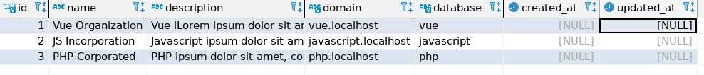

<h1>Steps</h1>

<h3>Step 1</h3>
<h5>Create 4 Databases</h5>
<ul>
	<li>MTlandlord</li>
	<li>vue</li>
	<li>javascript</li>
	<li>php</li>
</ul>

<h3>Step2</h3>

Remove .example

Change .env.example => .env

<h3>Step3</h3>

Install Composer: Use Command below

<i>composer install</i>

<h3>Step4</h3>

Landlord migration: Use Command below

<i>php artisan migrate --path=database/migrations/landlord --database=landlord</i>

<h3>Step5</h3>

Create Tenant in MTlandlord database

Copy the exact <strong>id,name,domain,database</strong>

You can put random information in the <strong>description</strong>

<h3>Step6</h3>

Tenant migration: Use Command below

<i>php artisan tenants:artisan "migrate --database=tenant"</i>

<h3>Step7</h3>

Run command below

<i>php artisan serve</i>
 
<i>localhost:8000</i>
<i>vue.localhost:8000</i>
<i>javascript.localhost:8000</i>
<i>php.localhost:8000</i>

<h3>Step8</h3>

Register to create users

